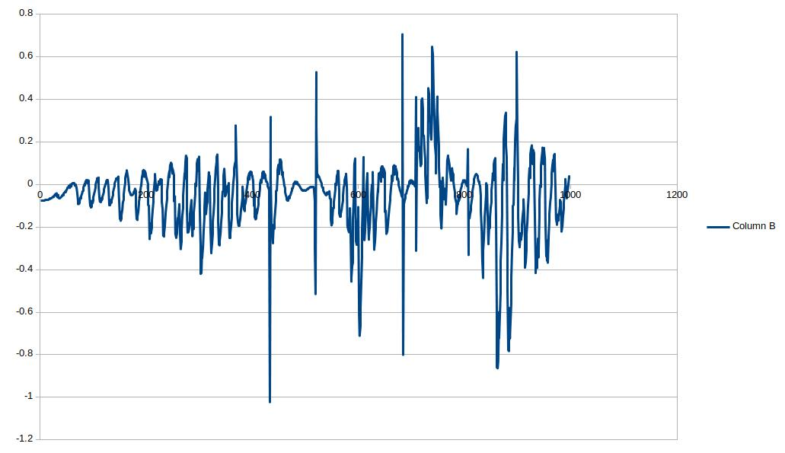

# **PID Controller** 
[](http://www.udacity.com/drive)

Overview
---
In this project, PID controller is implemented to control the steering. From the sensors we get the cross-track error and speed to compute the steering angle.

Compiling
---
The project is compiled in Ubunutu 18.04.
To compile,
```
    mkdir build
    cd build
    cmake ..
    make
    ./pid
 ```

Reflection
---
Effect of each individual parameter is described below.

The parameters are tuned manually.
P is increased until the car starts to oscillate. This is increased in steps of 0.01. P gain is chosen to be 0.1
Below image is the graph of steering angle with P = 0.1, I and D set to 0.


Next D is increased till the oscillations are stabilized. The final D gain is chosen to be 1.6.
Below is the graph of steering angle with P = 0.1, D = 1.6 and I set to 0.



I is increased till the error tends towards 0. The final I is chosen to be 0.01.
Below is the graph showing steering value with the PID controller.


In addition to the PID controller for steering control, a PI controller is implemented to control the speed.
P and I values are chosen to be P = 0.35, I = 0.01 and D = 0.

This can successfully run at 40mph and can go upto 45mph with some larger oscillations.
Below is the video showing the car run.


